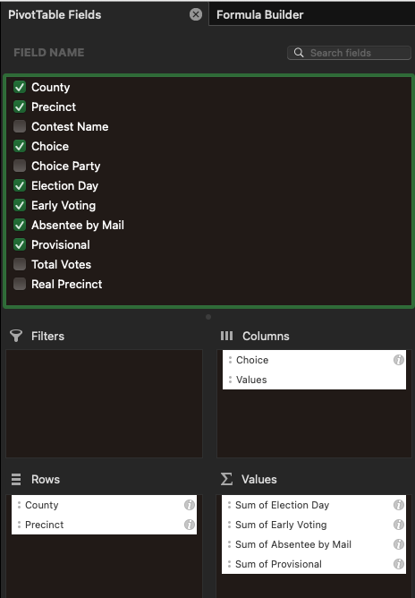
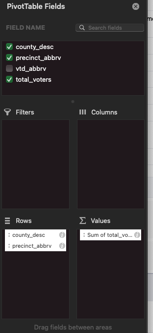

## Data Cleaning

There are many ways to clean data, almost as many as there are counties in the country. While it is tempting to write 
a script to do all the cleaning, most of the time, you'll never be able to use that script again, you have to know
code to write it and test it and Excel or Google Sheets can often make fast work of it. There are some counties that rely
on common data providers and that case, building a script makes sense since there are several counties with consistent
data formatting and usually available in data friendly ways.

North Carolina does a good job of providing data, but they do provide it in their own way. When we first start collecting
data, we tended to focus on a few contests and a few candidates. We have expanded that focus but there are definitely
data we clean out of our final "cleaned" election data. We make some exceptions for special elections or smaller ones
of some significance but for our general analysis, we are interested in statewide, pick a single
candidate contests. This is because we have found these contests show stronger patterns and since they have more
data, they are more statistically significant when we find these patterns.

Extract the voting data: [results_pct_20241105.zip](../../data/US_NC/original/2024/results_pct_20241105.zip)

These are the fields available in the precinct data for the North Carolina data:

| Field | Description                                                                                                                                                                                                                                                                                                                                                                                                                                                                                                                                  | Needed                                                                                                                                                      |
| ----- |----------------------------------------------------------------------------------------------------------------------------------------------------------------------------------------------------------------------------------------------------------------------------------------------------------------------------------------------------------------------------------------------------------------------------------------------------------------------------------------------------------------------------------------------|-------------------------------------------------------------------------------------------------------------------------------------------------------------|
| County | County in NC                                                                                                                                                                                                                                                                                                                                                                                                                                                                                                                                 | Yes                                                                                                                                                         |
| Election Date | The date of the 2024 General Election                                                                                                                                                                                                                                                                                                                                                                                                                                                                                                        | No, every value is the same                                                                                                                                 |
| Precinct | Precinct ID or Name                                                                                                                                                                                                                                                                                                                                                                                                                                                                                                                          | Yes                                                                                                                                                         |
| Contest Group ID | Internal NC Code to Identify elections and potential relationship to other elections                                                                                                                                                                                                                                                                                                                                                                                                                                                         | No, this is an internal code and we aren't interested in county level contests at this point                                                                |
| Contest Type | C - County Level<br/>S - State Level                                                                                                                                                                                                                                                                                                                                                                                                                                                                                                         | No - we are only interested in state level elections at this time                                                                                           |
| Contest Name | The name of the contest, for example:<br/>```NC Commissioner of Insurance```<br/>```US President```                                                                                                                                                                                                                                                                                                                                                                                                                                          | Yes, we need this to analyze the different contests                                                                                                         |
| Choice | The candidate name                                                                                                                                                                                                                                                                                                                                                                                                                                                                                                                           | Yes                                                                                                                                                         |
| Choice Party | The party of the candidate                                                                                                                                                                                                                                                                                                                                                                                                                                                                                                                   | Not critical, but sure.                                                                                                                                     |
| Vote For | The number of selections the voter can choose for the contest. For example, you might vote for more than one city council member                                                                                                                                                                                                                                                                                                                                                                                                             | No, we are only currently interested in races with one candidate choice                                                                                     |
| Election Day | The number of votes the candidate received on election day                                                                                                                                                                                                                                                                                                                                                                                                                                                                                   | Yes                                                                                                                                                         |
| Early Voting | The number of votes the candidate received for early voting                                                                                                                                                                                                                                                                                                                                                                                                                                                                                  | Yes                                                                                                                                                         |
| Absentee by Mail | The number of votes the candidate received by a mail in ballot                                                                                                                                                                                                                                                                                                                                                                                                                                                                               | Yes                                                                                                                                                         |
| Provisional | The number of provisional ballots received                                                                                                                                                                                                                                                                                                                                                                                                                                                                                                   | Yes, but usually such a small number it isn't a great statistic, unless there seem to be a significant number of them and then it deserves futher scrutiny. |
| Total Votes | The total votes cast                                                                                                                                                                                                                                                                                                                                                                                                                                                                                                                         | Yes. Sometimes the number of votes cast is more the sum of all the individual candidates votes.                                                             |
| Real Precinct | If the precinct is a real precinct at a physical location or administrative precinct. The North Carolina State Board of Elections (NCSBE) creates administrative precincts to track ballots cast in different ways, which cannot immediately be attributed to a voter's home precinct on election night.<br/><br/>Ballots cast during early voting and by absentee ballot are often tabulated in these administrative precincts for initial reporting. Some counties also use separate administrative precincts for provisional ballots. | Yes, although these can be hard to tease apart                                                                                                              |

The easiest way to start is to import the data into an Excel spreadsheet. That way, you can remove unnecessary data. 
You can sort data, removing the bottom half, remove columns, etc., in a fairly easy way and make the file easier to
manage.

<mark>
DO NOT import the precinct column as format "general". There are several situations where a precinct value may looks 
exactly like a number or date. For example, 01-01 becomes Jan 1, or 01.10 becomes the number 1.1. Import that column as text. There may be other columns from other states that may 
have additional columns where this could be an issue so take care that Excel doesn't transform your data.
</mark>

Clean up the data based on what we need or can assume. We'll go from a 233,511 row and 15 column file to a 101,753 line and 11 column file.

[NC_Clean_Step_1.xlsx](NC_Clean_Step_1.xlsx)

Separate the races into different sheets.

[NC_Clean_Step_2.xlsx](NC_Clean_Step_2.xlsx)

 
> #### Quick Quality Control at this point:<br/><br/>
> Make sure that you didn't move a row if one contest to the wrong sheet. An easy way to do this is to create a function
> in any cell:<br/><br/>
> ```=unique(c:c)```<br/><br/>
> It should say something like:<br/>
> ```
> Contest Name
> NC LIEUTENANT GOVERNOR
> 0
> ```

This means that it got the header, 0 for empty rows and the only other value is NC LIEUTENANT GOVERNOR. That means
we didn't spit it incorrectly.

### Pivot

We want the spreadsheet to have one column for every candidate/vote type combination and one row for each precinct.
Here is the format for the desired columns:

1. County
1. Precinct
1. Total Votes (if it's different then the sum of all the candidates' votes)
1. Candidate 1 Election Day
1. Candidate 1 Early Voting
1. Candidate 1 Absentee by Mail 
1. Candidate 1 Provisional
1. Candidate 2 Election Day
1. Candidate 2 Early Voting
1. Candidate 2 Absentee by Mail
1. Candidate 2 Provisional
1. Candidate 3 Election Day
1. Candidate 3 Early Voting
1. Candidate 3 Absentee by Mail
1. Candidate 3 Provisional

    etc... for every candidate

To perform this, you need to insert a pivot table for each race. Select all the data in the sheet and
Insert → PivotTable. The PivotTable fields should look like this image:



It may have a lot of columns when you're done, especially for contests with many candidates and vote types with the 
pivot table but this allows you to drive your reporting more easily by county and precinct.

You'll have to create a pivot table for every contest you are interested in.

> <b>Note:</b>  There are a lot of contests done but only 2 will be done in this example.

You will be left with:

[NC_Clean_Step_3.xlsx](NC_Clean_Step_3.xlsx)

> #### Quality Control at this point:<br/>
> Every pivot table should have exactly the same number of rows because the number of precincts in the state is the 
> same for each contest.

Next, we need to add registration data. Extract the [voter_stats_20241105.zip](../../data/US_NC/original/2024/voter_stats_20241105.zip) file.
Here are the fields in that file:

| Field | Description                             | Needed                                               |
|---|-----------------------------------------|------------------------------------------------------|
| county_desc | County in NC                            | Yes                                                  |
| election_date | Registration data for which election    | No, it's all the same                                |
| stats_type | Type of statistic                       | No, it's all Voter                                   |
| precinct_abbrv | Precinct Abbreviation                   | Yes                                                  |
| vtd_abbrv | Voter tabulation district abbreviation  | Maybe - Are precincts unique within the same county? |
| party_cd | Registered Party Code                   | Not for this example                                 |
| race_code | Race Code                               | Not for this example                                 |
| ethnic_code | Ethnicity code                          | Not for this example                                 |                                |
| sex_code | Gender code - M/F/U                     | Not for this example                                 |
| age | Age range                               | Not for this example                                 |
| total_voters | Total registered voters in the precinct | Yes                                                  |
| update_date | Date the data was updated               | No, all values are election day                      |

There is a lot of good demographic data in the North Carolina voting data and we do use if we have it, but for the
same of this tutorial, we'll ignore it.

Import the voter data into a second spreadsheet and get rid of all unnecessary data. 

Now, because there was a row for every demographic combination (about 250) for every precinct in every county, 
we will need to collapse that down into their precincts. We need to create another pivot table:



[NC_Voter_Data_Step_1.xlsx](NC_Voter_Data_Step_1.xlsx)

We need to marry the registration data with the vote data. Let's create a combined file. Eventually, you would want to
break up all the data into different counties and different contests to do analysis but let's pick one county and 
two contests. Wake is the largest county in North Carolina so will have lots of data to play with. We'll pick the 
Presidential race and the Attorney General race 

> <b>Note:</b> 2024 had a controversial Governor's race, didn't have a Senate race, so we picked another state wide contest.

Open a new Excel file. Create three sheets:
- Registration Data
- President
- Attorney General

Copy and paste data for Wake county from both the [NC_Voter_Data_Step_1.xlsx](NC_Voter_Data_Step_1.xlsx) and the
[NC_Clean_Step_3.xlsx](NC_Clean_Step_3.xlsx). You'll want the pivot tables for these new sheets (Presidential Pivot, 
Attorney General Pivot, Voter Data Pivot). Pivot tables don't paste in an easy to clean-up format, so when you 
paste, use "paste special" and just paste the values.

I cleaned up the column headers and the result is this file:

[NC_Combined_Step_1.xlsx](NC_Combined_Step_1.xlsx)

You may notice a couple of things in the file. Both the races for the President and Attorney General have a different
number of precincts than the registered voters sheet. They have 238 rows vs. 213 (including the title row). On closer
inspection, you have precincts with names like "ABSEN", "PROVI", "TRANS" and "EVKD". You will also notice that at the precinct
level, many columns have 0 values, even for winning candidates. It is common for counties and states to compile different
types of ballots in different ways. For example, mail in may just be mailed to the county clerk for that county and not
divided back up into the physical precinct of the voter, at least on the election website. This means that we are limited
in this situation to having detailed precinct data to election day votes.

Remove all data except for election day voting for both candidates. Remove the administrative precincts (ABSEN, PROVI, etc). You should 
now have the same number of precincts across all three sheets. To add the registration data across the contest sheets, 
sort the rows by precinct name in all three sheets and then copy the registration data over to the two other sheets, 
taking care to match the precinct names. There are probably easier ways of doing this, but to ensure the precincts 
do actually match, I create another column called match and in every row, I create and copy and paste the formula 
```=a2=i2``` where the ```a2``` is the cell with the precinct name in the second row and ```i2``` is the other cell 
with the precinct name. This way, if they match, each cell will say ```TRUE```. To make sure all of them are ```TRUE```, 
I, in another cell, use the equation ```=UNIQUE(k:k)``` where column k was the column we just created. It should not 
contain ```FALSE```. If it does, track down the issue and figure out why. This may seem silly, but if there are 10,000
precincts, it can be hard to check them by hand. Here's an example of the resulting file:

[NC_Combined_Step_2.xlsx](NC_Combined_Step_2.xlsx)

Great! The data is almost perfect.

We can clean up stuff we don't need anymore:
- Registration sheet since we incorporated into each contest.
- Remove any validation columns.
- Remove the duplicate precinct column

Create summary columns
- Total election day votes in each precinct. In the case of North Carolina, this is just the sum of everything, including write-ins

The final "cleaned" file for the 2024 General Election Day Votes for Wake County, NC for the Presidential and Attorney General contests:

[NC_Combined_Step_3.xlsx](NC_Combined_Step_3.xlsx)

> <b>Note:</b> While we don't probably care about smaller or write in candidates, we want to keep those columns in
> so that we have the accurate vote totals, not just the totals between the candidates we care about. Sometimes these
> numbers are provided, sometimes you have to combine them yourself.

### Next: [Analysis](../analysis)